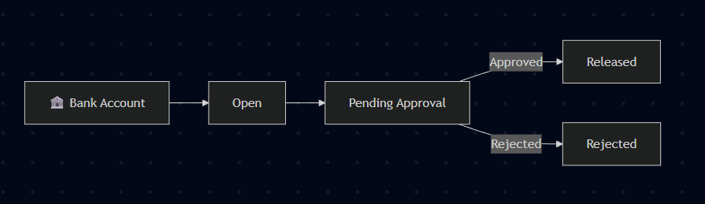

# 🚀 Custom Workflow for Business Central

This project provides a **custom approval workflow** implementation in Microsoft Dynamics 365 Business Central.  
It allows you to define and manage record approval processes with status tracking, workflow events, and styled UI indicators.



---

## 📌 Features
- ✅ Custom **Approval Status** Enum (`Open`, `Pending Approval`, `Released`, `Rejected`)
- ✅ Status field with **color-coded UI styling** (`StyleExpr`)
- ✅ Workflow integration using **custom events**
- ✅ Extensible enum for future statuses (e.g., On Hold, Escalated)
- ✅ Compatible with Business Central SaaS (Cloud)

---

## 📂 Project Structure
```
Custom Workflow/
│── src/
│ ├── Codeunits/
│ │ └── CustomWorkflowMgmt.al
│ ├── Enums/
│ │ └── BankAccountStatus.Enum.al
│ ├── Pages/
│ │ └── CustomPageExt.al
│ ├── Tables/
│ │ └── CustomTableExt.al
│── app.json
│── README.md
```
---

## 🛠️ Tech Stack
- **AL Language** (Microsoft Dynamics 365 Business Central Extensions)
- **Enums** for approval status
- **Pages & Page Extensions** with Style Expressions
- **Workflow Events & Codeunits**

---

## ⚡ Usage
1. Add the **Status (Approval Status Enum)** field to your custom table.
2. Use `GetStatusStyleExpr()` to display status with colors in the UI:
   - 🟢 **Open** → Favorable  
   - 🟡 **Pending Approval** → Ambiguous  
   - 🔵 **Released** → Strong  
   - 🔴 **Rejected** → Unfavorable  
3. Integrate with **workflow subscribers** to handle approval actions:
   - `OnSendForApproval`
   - `OnApproveDocument`
   - `OnRejectDocument`

---

## 🔧 Example
```al
procedure GetStatusStyleExpr(): Text
begin
    case Status of
        Status::Open:
            exit('Favorable');
        Status::Released:
            exit('Strong');
        Status::"Pending Approval":
            exit('Ambiguous');
        Status::Rejected:
            exit('Unfavorable');
    end;
end;
```
---

## 🚀 Deployment

* Clone this repository
* Open in **Visual Studio Code** with the AL extension
* Update **app.json** with your environment details
* Publish to your sandbox using `Ctrl+F5`

---

## 📄 License

This project is licensed under the **MIT License** – free to use and modify.

---

## 👨‍💻 Author

Developed by **Premkumar R** – Business Central Technical Consultant.